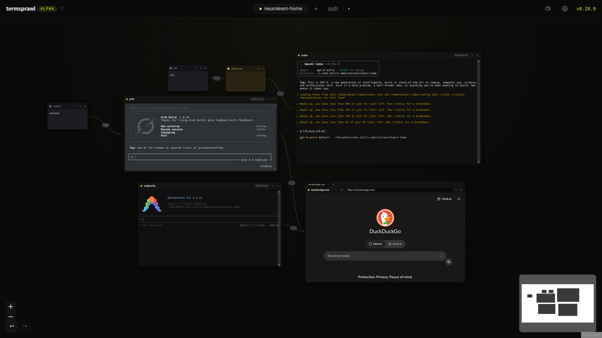

# termsprawl

A spatial terminal manager for Linux. Real terminals, editors, and agent
sessions live as draggable nodes on one infinite pan/zoom canvas — everything
sprawls, nothing hides in tabs.



  

## What it does

- **One infinite canvas** — pan, zoom, drag, and resize nodes anywhere. Layout
  is spatial, not stacked tabs: terminals, notes, groups, diffs, editors, and
  browsers sit where *you* put them. Every node is resizable (subtle handles
  appear when selected).
- **Real terminals** — every terminal node runs a genuine PTY (`node-pty`)
  rendered with xterm.js.
- **Sessions that survive restarts** — each terminal lives inside a persistent
  `tmux` session. Close the app, reopen it, and your terminals reattach with
  scrollback intact (cold starts replay a byte-capped scrollback snapshot).
- **Projects & persistence** — tabs, one project per tab; layouts persist to a
  git-shareable project file, so you can commit and share a workspace.
- **Agent nodes** — spawn Claude Code / Codex / Antigravity / Grok / OpenClaude
  / OpenCode right on the canvas, with hook-driven status badges where the CLI
  supports hooks (RUNNING / NEEDS YOU), unread dots, and OS notifications when
  an agent finishes. OpenClaude points at any OpenAI-compatible endpoint,
  including local models; each preset reports its real capabilities instead of
  claiming features its CLI does not expose.
- **Sticky, group, editor, and diff nodes** — notes, frames, and Monaco-based
  editors/diffs as first-class canvas citizens.
- **Embedded browser nodes** — a real sandboxed Chromium browser on the canvas,
  one guest per tab, hardened (no Node/preload, navigation policy), with an
  opt-in, localhost-only CDP surface so an external agent (Playwright/Puppeteer)
  can drive the exact page you're watching. New browser nodes open at a
  readable size (1000×720) and are **user-resizable with no artificial
  maximum**. Shared authenticated sessions mean a sign-in done in the canvas
  browser is the session agents use.
- **Source control** — stage, commit, branch, push/pull, and manage worktrees
  from a panel bound to the active project.
- **Undo/redo, keyboard canvas navigation, dark lime-on-black UI.**

## Status

**Pre-1.0 · actively maintained.** Current version: **0.28.0**.

"Pre-1.0" is deliberate and not a hedge: the desktop application is usable and
maintained today, but the on-disk project format and internal interfaces are
not frozen, and the only supported release line is the most recent one. See
[CHANGELOG.md](CHANGELOG.md) for what shipped recently and
[ROADMAP.md](ROADMAP.md) for the 1.0 readiness criteria and non-goals.

What ships today:

- **Desktop app** (free, offline, no account) — terminal canvas, tmux session
  continuity, projects & persistence, sticky/group/editor/diff nodes, agents
  with context links and managed accounts, source control (git status, staging,
  commits, branches, sync, worktrees, AI commit messages), SSH remote projects
  (terminals, git, and file operations run on the remote host),
  embedded browser nodes (opt-in agent control via CDP), Telegram bot v2,
  provider-agnostic chat nodes (OpenAI-compatible + Anthropic, streaming,
  thinking blocks, permission cards, slash commands), keyboard canvas
  navigation, named node links, first-run onboarding, and auto-update with
  announcements.
- **Server Edition** — the same app runs in a browser via plain `node:http` +
  WebSocket RPC. Serves the built renderer, tunnels all core services
  (terminals, projects, git, agent hooks, file tree, chat), with auto-save and
  shutdown safety. Binds to loopback by default; see [SECURITY.md](SECURITY.md).
- **Standalone relay service** (`relay/`) — host↔client terminal frames are
  sealed with X25519 key agreement (HKDF-SHA256) and AES-256-GCM; the relay
  routes ciphertext envelopes only and never holds the keys, with GitHub
  device-flow auth, single-use invites with expiry/revocation/quotas, and an
  admin API. In-app pairing with fingerprint confirm and remote terminal frames
  over the tunnel.

**Hosted services are separate and optional.** Encrypted backup and hosted
canvas spaces run as private preview services with **test-mode billing**; they
are preview-stage, their pricing and quotas are not final, and the project
claims no revenue or paying customers. The desktop app never requires them.
This repository contains the client code and the relay service; the hosted
control plane is not in this repository.

**Linux only** — AppImage and `.deb` artifacts. No macOS or Windows support, by
design.

## Install

Download the latest **AppImage** or **.deb** from the
[Releases](https://github.com/dazeb/termsprawl/releases) page. Releases from the
next version onward also publish `SHA256SUMS` (the AppImage, `.deb`, and
updater manifest) — verify a download with `sha256sum -c SHA256SUMS`.

Runtime requirements:

- **tmux >= 3.2** — required for session continuity. Without it, terminals
  still work but lose scrollback across restarts.
  `sudo apt install tmux` (Debian/Ubuntu) · `dnf install tmux` · `pacman -S tmux`
- **FUSE** — to run the AppImage: `libfuse2t64` (Ubuntu 24.04),
  `libfuse2` (20.04–22.04), `fuse-libs` (Fedora), `fuse2` (Arch). Fallback:
  `./termsprawl-*.AppImage --appimage-extract-and-run`
- A shell (`$SHELL` or `/bin/bash`) and glibc >= 2.31 (Ubuntu 20.04+).

## Build from source

Requires Node 20+ (Node 22+ for the `relay/` workspace), pnpm 11, tmux, and
Linux build tools for `node-pty`. Full setup, the gate order, and contribution
rules are in [CONTRIBUTING.md](CONTRIBUTING.md).

```bash
pnpm install        # deps + rebuilds node-pty against Electron's ABI
pnpm run dev        # dev mode with renderer HMR
pnpm run verify     # canonical gates: typecheck → desktop build → Server build →
                    # release-safety checks → vitest suite (in that order)
pnpm test           # vitest suite on its own (requires both builds first)
pnpm run dist       # AppImage + .deb into dist/
```

### Server Edition

The app also runs as a plain Node web server (no Electron). Build and start:

```bash
pnpm run build && pnpm run build:server
TERMSPRAWL_SERVER_ENTRY=1 PORT=3110 node out/server/index.js
# → http://localhost:3110
```

The Server Edition serves the same UI, tunnels all core services (terminals,
projects, git, agent hooks, file tree) over a WebSocket RPC shim, and
persists state to `~/.config/termsprawl/` (or `$TERMSPRAWL_DATA`).

## Project

- **Maintainer:** Darren Bennett (sole maintainer) — `daz@dazeb.dev`
- **License:** MIT — see [LICENSE](LICENSE). No CLA or DCO for contributions.
- **Platform:** Linux only, by design. No macOS or Windows roadmap.

### Verification snapshot

At commit `ebc5f66139ec3161653a84fc9e1044c61f557921` (v0.28.0), on 2026-09-18:
`pnpm run typecheck` passed, the desktop and Server Edition builds passed, and
the vitest suite reported **1,112 passed with one opt-in skip** (the live
installer smoke test, which only runs when explicitly enabled). The
[originality screen](docs/VERIFICATION.md) reported no copied blocks across 273
source files. This was **self-verified** — no external reviewer was present.
Full record, including which gates were *not* run, in
[docs/VERIFICATION.md](docs/VERIFICATION.md) and
[docs/PROJECT-HEALTH.md](docs/PROJECT-HEALTH.md).

### Known limitations

- **One maintainer** — the main sustainability risk; succession intent is in
  [GOVERNANCE.md](GOVERNANCE.md).
- **Pre-1.0** — project files and internal APIs can change between minor
  releases.
- **No independent assessment** — the two published audits are maintainer
  self-audits, and no independent security or accessibility review has been
  performed.
- **CI is not publicly visible** — CI runs on a self-hosted Gitea runner;
  results are republished in the verification record.
- **No signed releases, SBOM, or build provenance** — artifacts are not
  code-signed and no attestation is published. Download integrity relies on
  HTTPS plus the SHA256SUMS file that releases from the next version onward
  publish (v0.28.0 and earlier shipped without a checksum file; the auto-update
  manifest `latest-linux.yml` is not a signature).
- **Hosted services are preview-stage**, with test-mode billing and quotas that
  are not final.

### Trust and project documents

- [SECURITY.md](SECURITY.md) — supported versions and private reporting
- [CONTRIBUTING.md](CONTRIBUTING.md) — setup, gates, clean-room rules
- [GOVERNANCE.md](GOVERNANCE.md) — decision process and maintainer path
- [CODE_OF_CONDUCT.md](CODE_OF_CONDUCT.md) — Contributor Covenant 2.1
- [ROADMAP.md](ROADMAP.md) — priorities, funded work packages, non-goals
- [FUNDING.md](FUNDING.md) — current funding status and priorities
- [CHANGELOG.md](CHANGELOG.md) — release history
- [docs/PROJECT-HEALTH.md](docs/PROJECT-HEALTH.md) — project state in one page
- [docs/VERIFICATION.md](docs/VERIFICATION.md) — dated verification record
- [docs/AUDIT-2026-08-29.md](docs/AUDIT-2026-08-29.md) and
  [docs/AUDIT-2026-09-13.md](docs/AUDIT-2026-09-13.md) — maintainer self-audits
- [THIRD-PARTY-NOTICES.md](THIRD-PARTY-NOTICES.md) — bundled dependencies and
  licenses
- Project background: https://termsprawl.com/project · funding priorities:
  https://termsprawl.com/funders · docs: https://docs.termsprawl.com

### Repository notes

- `docs/FEATURES.md` — the feature spec (what we're building toward)
- `docs/OWN-WORK.md` — concept reference for features we originated
- `PLAN.md` — the historical implementation plan (phases, tasks, verification)
- `AGENTS.md` — operational guide for AI agents working in this repo

## License and originality

MIT — see [LICENSE](LICENSE).

This is an independent implementation: termsprawl's code was written from
scratch, and it is screened for textual similarity against the prior project
with an automated checker (`scripts/check-originality.sh`) that flags identical
blocks of five or more non-trivial lines. That check is a heuristic, not a
legal guarantee — it cannot detect paraphrased copying or copied ideas, and it
only compares against one prior tree. The project therefore makes no absolute
originality claim; the methodology and its limits are documented in
[docs/VERIFICATION.md](docs/VERIFICATION.md).
